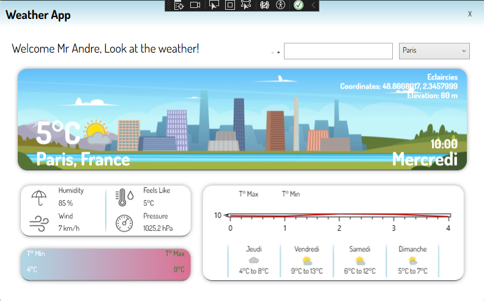

# WeatherApp

Welcome to **WeatherApp**, a simple yet powerful tool to find the current weather in any city in France. Using a reliable weather API, the app provides up-to-date information to keep you informed about the conditions in your area or anywhere else in the country.

## Features
- **Search by City**: Quickly find the weather for any city in France.
- **Real-Time Data**: Get accurate and current weather updates using an API.
- **User-Friendly Interface**: Simple and intuitive design for effortless navigation.

## How It Works
1. Enter the name of a city in France.
2. The app fetches weather data from an API and displays the results.
3. View details such as temperature, humidity, and weather conditions.

## Project Purpose
The WeatherApp was created to:
- Learn how to integrate external APIs into a project.
- Practice handling and displaying data dynamically.
- Build a practical application with real-world use cases.

## How to Use
1. Clone the repository and set up the project.
2. Obtain an API key from a weather service provider.
3. Configure the API key in the application settings.
4. Run the app and start searching for city weather!

## What We Learned
This project helped us:
- Understand how to work with APIs.
- Improve our skills in handling asynchronous data requests.
- Develop a better understanding of designing user-friendly applications.

Thank you for checking out WeatherApp! We hope it makes staying informed about the weather more convenient.
